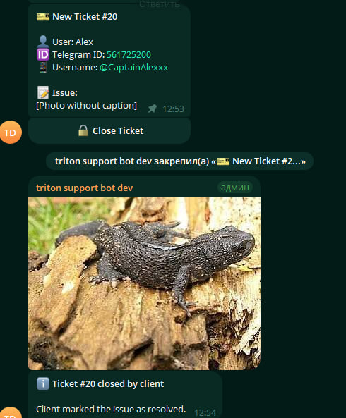

# Telegram Support Bot

A support desk for Telegram, built on Laravel 12 and [Nutgram](https://nutgram.dev).
A client writes to the bot, the request becomes a tracked ticket in an operator group,
and neither side has to dig through a shared chat to find it again.

Built for an internal support team at a logistics company and used in production.

## What it does

**Tickets.** A client message opens a ticket thread in the operator group with the
client's Telegram ID, username and the original request attached. Operators reply
inside the thread; either side can close the ticket. On close the client is asked to
rate the support from 1 to 5.



**Broadcasts.** A three-step wizard: pick the recipient group (all, clients, employees,
agents), send the message — text or photo, with or without a caption — then set the date
and time. A preview is shown before anything is scheduled, and the whole flow can be
cancelled at any step with `/mmsg`.


**Working schedule.** Weekday hours plus one-off date overrides for holidays and short
days, so a client writing at 3 a.m. gets an honest answer about response time instead of
silence.


## Stack

| | |
|---|---|
| Runtime | PHP 8.2, Laravel 12 |
| Telegram | Nutgram |
| Storage | MySQL / MariaDB |
| Queues | Laravel queues under Supervisor |
| Deploy | Docker |

## How it is put together

Conversation state lives in Nutgram conversations, so multi-step flows such as the
broadcast wizard survive restarts and cannot be desynchronised by a user replying out of
order. Scheduled broadcasts are dispatched as queued jobs rather than sent inline, which
keeps webhook responses fast and lets a failed send retry on its own.

Tickets and messages are separate models. A ticket owns the thread in the operator group;
messages are mirrored both ways, so the operator group is the single place where support
history lives.

## Running it

```bash
git clone https://github.com/CaptainAlexxxx/telegram-support-bot.git
cd telegram-support-bot
composer install
cp .env.example .env
php artisan key:generate
php artisan migrate
```

Set in `.env`:

```
TELEGRAM_TOKEN=            # from @BotFather
SUPPORT_GROUP_ID=          # operator group, bot must be admin
```

Then register the webhook and start the queue worker:

```bash
php artisan nutgram:hook:set https://your-domain/webhook
php artisan queue:work
```

## Notes

Interface strings are Ukrainian; the codebase is English. Localisation goes through
Laravel's translation files, so adding a language means adding one file.
